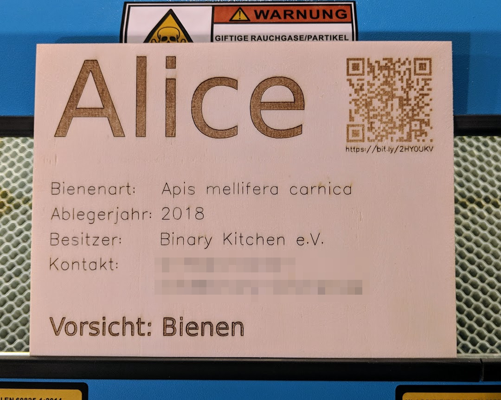

# Namensschild für Bienen
Ein einfaches Namensschild für unsere Bienenvöler "Alice" und "Bob" in der www.binary-kitchen.de

## Erklärung
- rot: engrave
- grün: mark
- schwarz: cut

## Hinweise
- Bei den gravierten Stellen ist außen noch ein "Auslaufbereich". Unser Nova 35 graviert sonst die Anfangs- und Endbereiche zu stark.
- Erstellt mit Inkscape
- Vektor-Text erstellt mit Plugin: "Hershey Text"
- Schriftart für den Rest: Montserrat

## Lizenz und Copyright

[CC-BY-NC-SA 4.0](https://creativecommons.org/licenses/by-nc-sa/4.0) - [Timo Schindler](https://www.timoschindler.de).
